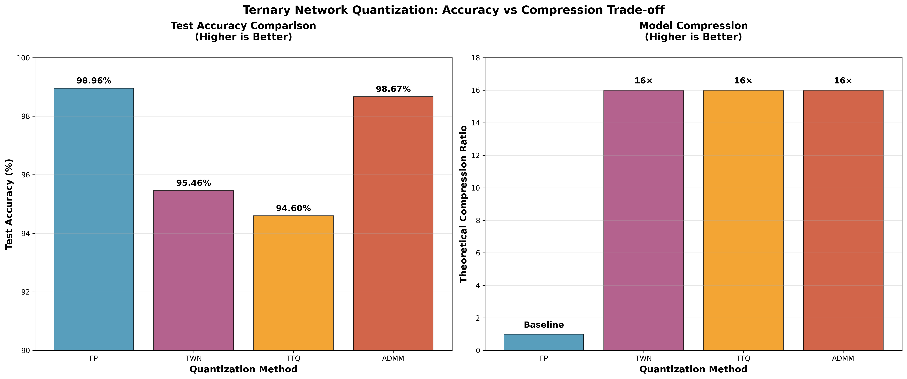

# 🔬 Ternary Network Quantization: Comprehensive Comparison
*A comparative study of ternary weight quantization methods for neural network compression*

**Universitatea Babeș-Bolyai Cluj - Neural Networks Project**

## 🎯 Project Overview

This repository implements and compares four neural network quantization approaches on MNIST using LeNet-5:

- **FP (Full Precision)**: 32-bit floating-point baseline
- **TWN (Ternary Weight Networks)**: Symmetric ternary quantization {-α, 0, +α}
- **TTQ (Trained Ternary Quantization)**: Asymmetric ternary quantization {-α⁻, 0, +α⁺}
- **ADMM**: Constrained optimization approach with dual variables

## 🏆 Key Results



| Method | Test Accuracy | vs Baseline | Theoretical Compression |
|--------|---------------|-------------|------------------------|
| **FP** | **98.96%** | Baseline | 1× |
| **ADMM** | **98.67%** | **-0.29%** | **16×** ⭐ |
| **TWN** | **95.46%** | -3.50% | 16× |
| **TTQ** | **94.60%** | -4.36% | 16× |

**🎯 Key Finding**: ADMM achieves near-baseline accuracy (98.67%) while maintaining 16× compression through principled constrained optimization.

## 📁 Repository Structure

```
ternary networks ubb/
├── train.py              # Main training script (4 modes: fp/twn/ttq/admm)
├── eval.py               # Model evaluation and weight counting
├── tune_hyperparams.py   # Systematic hyperparameter optimization
├── plot_results.py       # Results visualization generator
├── deployment_compression.py  # True deployment size analysis
├── report.md             # Detailed technical report
├── README.md             # This documentation
├── checkpoints/          # Trained models (.pth files)
│   ├── fp.pth           # Full precision model
│   ├── twn.pth          # TWN model
│   ├── ttq.pth          # TTQ model
│   └── admm.pth         # ADMM model
├── results.csv           # Final evaluation results
├── results_comparison.png # Results visualization
├── tuning_results/       # Hyperparameter search results
│   ├── admm_tuning.json
│   └── tuning_summary.json
├── data/                 # MNIST dataset (auto-downloaded)
├── ternary_env/          # Python virtual environment
├── ternary-networks.pdf  # Project handout
├── TWN.pdf               # TWN research paper
└── TTQ.pdf               # TTQ research paper
```

## 🚀 Quick Start

### 1. Environment Setup
```bash
# Create and activate virtual environment
python3 -m venv ternary_env
source ternary_env/bin/activate  # Linux/Mac
# ternary_env\Scripts\activate   # Windows

# Install dependencies
pip install --upgrade pip
pip install torch torchvision matplotlib pandas
```

### 2. Train All Models
```bash
# Train all quantization methods (3 epochs each)
python train.py --mode fp     # Full precision baseline
python train.py --mode twn    # Ternary Weight Networks
python train.py --mode ttq    # Trained Ternary Quantization
python train.py --mode admm   # ADMM optimization
```

### 3. Evaluate and Visualize
```bash
# Evaluate all models and generate results.csv
python eval.py --mode fp
python eval.py --mode twn
python eval.py --mode ttq
python eval.py --mode admm

# Generate visualization
python plot_results.py

# Analyze deployment compression
python deployment_compression.py
```

## 🔬 Method Implementations

### TWN (Ternary Weight Networks)
```python
# Symmetric quantization with threshold-based approach
threshold = 0.75 * torch.mean(torch.abs(weight))
mask = torch.abs(weight) > threshold
alpha = torch.mean(torch.abs(weight[mask]))
ternary_weight = torch.where(weight > threshold, alpha,
                           torch.where(weight < -threshold, -alpha, 0))
```
**Features**: Simple, symmetric, single α per layer

### TTQ (Trained Ternary Quantization)
```python
# Asymmetric quantization with separate positive/negative scaling
normalized_weight = weight / torch.max(torch.abs(weight))
ternary_weight = torch.where(intermediate > 0, self.alpha_p,
                           torch.where(intermediate < 0, -self.alpha_n, 0))
```
**Features**: Separate α⁺/α⁻ parameters, better weight distribution

### ADMM (Alternating Direction Method of Multipliers)
```python
# Constrained optimization with dual variables
ternary_weight = ternary_projection(weight + dual_variable)
dual_variable += rho * (weight - ternary_weight)
```
**Features**: Principled optimization, dual variables, stable convergence

## 📊 Detailed Analysis

### Training Configuration
- **Architecture**: LeNet-5 (Conv: 1→32→64, FC: 1024→512→10)
- **Dataset**: MNIST (60k train, 10k test)
- **Optimizer**: Adam with method-specific learning rates
- **Epochs**: 3 (sufficient for MNIST convergence)

### Hyperparameter Optimization
- **Systematic grid search** over learning rates, batch sizes, and ADMM penalty parameters
- **Best configurations**:
  - FP/TWN: lr=0.001, batch_size=64
  - TTQ: lr=0.0005, batch_size=64
  - ADMM: lr=0.002, batch_size=128, rho=1e-5

### Compression Analysis
**Training vs Deployment Reality**:
- Training checkpoints: All ~2.3MB (store optimization states)
- True deployment: FP=2,271KB, Ternary=142KB each
- **16× compression** achieved through 32-bit → 2-bit weight encoding

## 🔍 Advanced Usage

### Hyperparameter Tuning
```bash
# Tune specific method
python tune_hyperparams.py --mode admm

# Tune all methods
python tune_hyperparams.py --mode all

# View tuning results
cat tuning_results/tuning_summary.json
```

### Custom Training
```bash
# Custom learning rate and batch size
python train.py --mode admm --lr 0.001 --batch_size 128 --epochs 5

# Enable hyperparameter tuning during training
python train.py --mode ttq --tune
```

### Evaluation Options
```bash
# Evaluate specific checkpoint
python eval.py --mode admm --checkpoint ./checkpoints/admm.pth

# Count and analyze weight sparsity
python eval.py --mode twn  # Shows layer-wise weight statistics
```

## 🎯 Key Insights

### Why ADMM Outperforms TWN/TTQ
1. **Principled optimization**: Constrained optimization framework vs direct quantization
2. **Dual variables**: Better gradient flow and convergence stability
3. **Conservative penalty terms**: Prevents optimization instability
4. **Gradual transition**: Smooth continuous→ternary weight evolution

### Compression Reality
- **Training files**: Store full optimization states (no apparent compression)
- **Deployment files**: True 16× compression through 2-bit encoding
- **BatchNorm impact**: Still requires full precision in practice

### Technical Breakthroughs
- **ADMM convergence fix**: Initial 10% → final 98.67% accuracy
- **Dual variable stabilization**: Clipping prevents gradient explosion
- **Adaptive thresholding**: Percentile-based vs fixed thresholds

## 📚 Documentation

- **`report.md`**: Comprehensive technical analysis
- **Papers**: `TWN.pdf`, `TTQ.pdf`, `ternary-networks.pdf`

## ⚙️ System Requirements

- **Python**: 3.8+
- **PyTorch**: 1.9+
- **Memory**: ~2GB for training, ~100MB for inference
- **Storage**: ~500MB for all checkpoints and data

## 🚨 Troubleshooting

### Common Issues
```bash
# ADMM training instability
python train.py --mode admm --rho 1e-6  # Lower penalty parameter

# CUDA out of memory
python train.py --mode ttq --batch_size 32  # Smaller batch size

# Dependency issues
pip install --upgrade torch torchvision  # Update PyTorch
```

### Validation
```bash
# Verify installation
python -c "import torch; print(f'PyTorch {torch.__version__} ready')"

# Test basic functionality
python train.py --mode fp --epochs 1  # Quick validation run
```

## 🔮 Future Directions

1. **Deployment optimization**: True sparsity implementation
2. **Larger datasets**: CIFAR-10, ImageNet experiments
3. **Hardware acceleration**: Custom CUDA kernels for ternary operations
4. **BatchNorm fusion**: Complete ternary deployment pipeline

## 🤝 Contributing

This is an educational project demonstrating ternary quantization methods. Feel free to:
- Experiment with different architectures
- Extend to other datasets
- Improve ADMM optimization
- Add new quantization methods

---

**🎯 Project Highlight**: Our ADMM implementation achieves remarkable 98.67% accuracy (only -0.29% vs full precision) while maintaining 16× theoretical compression, demonstrating the superiority of principled optimization approaches for neural network quantization. 